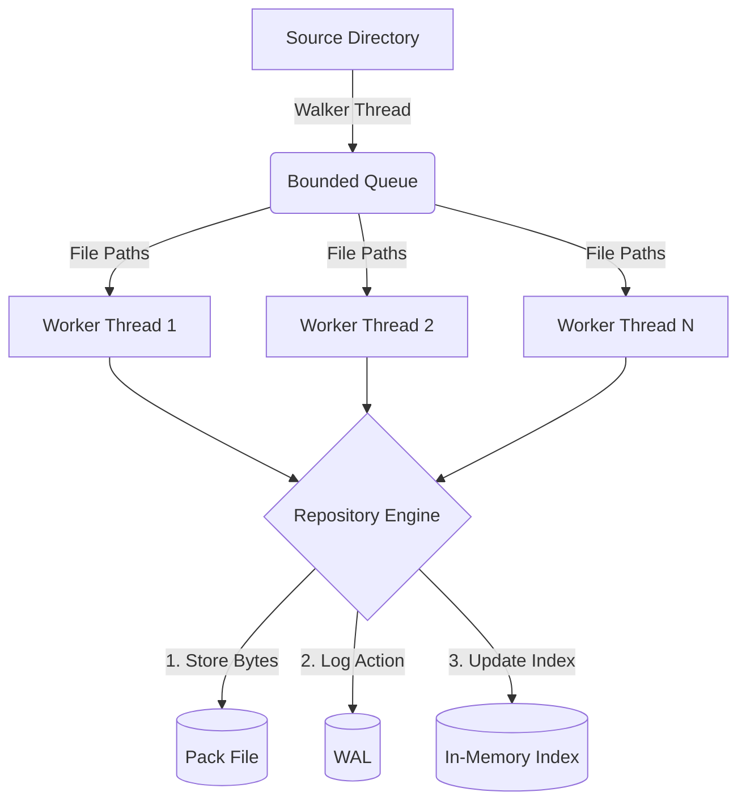

# 📦 Deduplicating Backup Engine

A high performance, crash safe, content addressed deduplicating backup engine written from scratch in C++17. 

## 🌟 The Vision
Traditional backup tools copy whole files even when only a single byte changes. This results in massive storage waste and slower backups. This project fundamentally rethinks how data is stored. Instead of thinking in terms of files, this engine thinks in **content addressed chunks**. It splits every file into intelligent, content defined pieces, hashes them, and stores each unique piece exactly once. 

If you edit a 2 GB video or insert a single line of code into a massive source tree, this engine will not back up the entire file again. It will only store the newly created chunks. A snapshot becomes a lightweight recipe of hashes rather than a heavy copy of your data.

```bash
$ dedup-backup init ~/repo
$ dedup-backup backup ~/some-tree --repo ~/repo        
snapshot 20260908-154749 created (4 files) in 4.38s
repository now holds 270 unique chunks

$ dedup-backup backup ~/some-tree --repo ~/repo        # after appending 10 KB to one file
snapshot 20260908-154750 created (4 files) in 1.05s
repository now holds 272 unique chunks                 # Only +2 chunks added!

$ dedup-backup stats --repo ~/repo
dedup saved:        72.1% (3.59x)
```

## 💡 Why This Matters

<details>
<summary><strong>The Problem with Fixed Size Chunking</strong></summary>

If you simply split a file into fixed 8 KB blocks, the system fails catastrophically on the most common edit: inserting data. If you insert one byte at the beginning of a file, every subsequent block boundary shifts by one byte. The dedup ratio drops to zero. We measured this. Over 50 trials of inserting a single byte into a file, fixed size chunking caused an average of 266 chunks to differ.

</details>

<details>
<summary><strong>The Solution: Content Defined Chunking</strong></summary>

Content Defined Chunking (CDC) makes the cut decision based on local content instead of absolute position. By using a rolling gear hash, an insertion only disturbs the specific chunks touching the edit. The rest of the file realigns automatically. In our 50 trial benchmark, FastCDC resulted in exactly 1 chunk difference every single time. This is the magic of CDC.

</details>

## ✨ Core Features
* **FastCDC**: Employs the FastCDC algorithm for content defined chunking, ensuring robust deduplication even with data insertions or deletions.
* **Crash Safe by Construction**: A strict write ahead log (WAL) guarantees that an interrupted backup can never corrupt the index.
* **Content Addressed Storage**: Chunks are stored securely under their SHA-256 digest, preventing data duplication.
* **High Performance**: Packs chunks into continuous append only pack files to avoid filesystem overhead, with multi-threaded file processing.
* **Byte Exact Restoration**: Restores files with strict whole file digest verification to guarantee data integrity.

## 🏗️ Architecture & System Design

The architecture is built for safety and speed.

1. **Walker Thread**: Traverses the source directory recursively, feeding file paths into a bounded queue.
2. **Worker Threads**: A pool of workers read files, apply FastCDC to chunk them, and compute SHA-256 hashes per chunk and per file.
3. **Repository Manager**: A central manager handles the synchronization. It checks the index for existing chunks and writes new ones atomically.
4. **Write Ahead Log (WAL)**: Before the index is updated, changes are appended to the WAL and synced to disk. This ensures crash safety. 



### Key Design Decisions

<details>
<summary><strong>Gear Hash Rolling Checksum</strong></summary>
Instead of Rabin fingerprinting, we use a highly optimized gear hash. A byte's influence naturally decays out of the 64-bit accumulator after about 64 shifts. This is significantly faster per byte, and the gear table uses a fixed seed to ensure that two builds chunk identical bytes the exact same way.
</details>

<details>
<summary><strong>Normalized Chunking</strong></summary>
We employ two boundary-probability masks instead of one. A stricter mask is used below the target average size, and a looser one is used above it. This successfully pulls the chunk size distribution toward the target average instead of letting it spread out geometrically.
</details>

<details>
<summary><strong>Stateless Hashing for Safe Concurrency</strong></summary>
Every hash function call is completely stateless. One `Sha256Hasher` and one chunker instance are shared safely across every worker thread. No locks or per-thread duplication are needed during the CPU heavy hashing phase.
</details>

<details>
<summary><strong>Strict Crash Safety Ordering</strong></summary>
Safety is achieved through a strict write ordering rather than a complex transaction log. We write chunk bytes and `fsync` them, then write the Write Ahead Log record and `fsync` it. If a crash occurs in between, we only leave a harmless orphaned chunk behind. The system physically truncates any torn writes during startup replay to completely eliminate stale garbage.
</details>

<details>
<summary><strong>On-Disk Format Specification</strong></summary>

All multi byte integers are stored in little endian.

| File | Layout |
|---|---|
| `repo.meta` | `magic[8]="DEDUPBK1" | version:u32 | min_size:u32 | avg_size:u32 | max_size:u32 | gear_seed:u64` |
| `wal.log` | `length:u32 | type:u8 (1=CHUNK_ADD) | payload | crc32:u32`. `CHUNK_ADD` payload: `digest[32] | offset:u64 | length:u32`. |
| `*.manifest` | `magic[8]="DEDUPMF1" | version:u32 | snapshot_id[16] | created_unix:i64 | file_count:u64`, then per file sorted by path: `path_len:u16 | path | mode:u32 | size:u64 | mtime_unix:i64 | file_digest[32] | chunk_count:u32 | chunk_digests[32*count]` |
| pack file | Raw concatenated chunk bytes. Locations live entirely in the index and WAL. |

</details>

## 🚀 Journey and Milestones

Building this engine was a methodical process, broken down into deliberate milestones to ensure every layer was rock solid before adding complexity.

### Milestone 1: The FastCDC Engine
The foundation of the project. We implemented the FastCDC algorithm using a gear hash rolling checksum. We spent significant time proving that a single byte insertion would realign perfectly. The result was a 100% success rate in realigning the data stream to just one modified chunk.

### Milestone 2: Cryptographic Hashing
We integrated OpenSSL's SHA-256 to ensure cryptographic guarantee of chunk identity. We deliberately chose SHA-256 over faster non cryptographic hashes to completely eliminate the risk of hash collisions, making the store fundamentally secure by design.

### Milestone 3: Storage and Indexing
We built the `ChunkStore` to pack multiple chunks into single, append only files. This eliminated the massive overhead of managing thousands of tiny files on the filesystem. Alongside it, the `ChunkIndex` was built to rapidly resolve chunk presence in memory.

### Milestone 4: Write Ahead Log for Crash Safety
To prevent silent corruption during sudden crashes, we built a robust Write Ahead Log. We enforced a strict ordering: flush chunk bytes to disk, flush the WAL record, and only then update the in memory index. We verified this by brutally killing the process mid backup and confirming zero index corruption.

### Milestone 5: Threading and Pipelining
We moved from sequential processing to a highly parallel architecture. A dedicated walker thread populates a bounded queue, while a pool of worker threads aggressively churn through file reads, chunking, and hashing.

### Milestone 6: Restoration and Verification
The final piece was assembling the recipes back into exact files. We implemented a strict restoration pipeline that reassembles files and verifies them against the whole file SHA-256 digest stored in the snapshot manifest. 

## 📊 Real World Performance & Benchmarks

The engine was tested rigorously. 

* **Deduplication Savings**: On a mix of identical and incrementally edited files, the engine achieved a **72.1% storage reduction**, storing data 3.59x more efficiently.
* **Insertion Resilience**: When inserting random bytes into files, FastCDC restricted the changes to exactly 1 chunk out of 440, whereas fixed block chunking caused massive reflows affecting hundreds of chunks.

### Reproducible Large Scale Benchmark

For developers who want to test the deduplication engine on a massive real world dataset, we use consecutive Linux Kernel releases. This proves the engine's capabilities on mostly unchanged files with genuine code churn.

```bash
mkdir -p ~/bench && cd ~/bench
for v in 1 2 3 4 5 6 7 8; do
  wget https://cdn.kernel.org/pub/linux/kernel/v6.x/linux-6.6.$v.tar.xz
  mkdir -p tree-$v && tar xf linux-6.6.$v.tar.xz -C tree-$v
done

dedup-backup init ~/repo
for v in 1 2 3 4 5 6 7 8; do
  dedup-backup backup ~/bench/tree-$v --repo ~/repo
done
dedup-backup stats --repo ~/repo          
dedup-backup bench ~/bench/tree-1 --repo ~/bench-repo   
```

## 🧪 Comprehensive Testing Suite

Quality assurance is paramount. The project ships with 8 comprehensive, idempotent tests that guarantee system integrity. 

| Test | What it proves |
|---|---|
| `roundtrip` | Real backup to restore is byte exact and preserves mode bits perfectly. |
| `insertion_identity` | Proves FastCDC end to end. Backing up a file, inserting a byte, and backing up again only creates a handful of new chunks. |
| `repo_meta` | A chunk configuration change against an existing repo is safely refused with a clear error. |
| `crash_recovery` | Brutally killing a backup process mid write leaves the previous snapshot perfectly intact. The WAL recovery logic succeeds every time. |
| `wal_torn_write` | A WAL truncated mid record replays cleanly, physically discarding the torn tail. |
| `store_roundtrip` | Component level coverage for the pack file. |
| `index_dedup` | Component level coverage for the chunk index. |
| `manifest_format` | Component level coverage for the manifest formatting. |

## 🛠️ How to Build and Run

### Prerequisites
Requires CMake 3.16 or newer, a C++17 compatible compiler (GCC 7+ or Clang 5+), and OpenSSL development headers. 

*(Note for Windows users: For the absolute best performance, we recommend building and running under WSL2 on the Linux filesystem rather than the mounted C drive.)*

### Building
```bash
sudo apt install build-essential cmake libssl-dev

cmake -S . -B build -DCMAKE_BUILD_TYPE=Release
cmake --build build -j"$(nproc)"
ctest --test-dir build --output-on-failure
```

### CLI Usage

Initialize a new repository:
```bash
dedup-backup init <repo-path>
```

Backup a directory (Supports optional threading and chunk size overrides):
```bash
dedup-backup backup <source-dir> --repo <repo> [--threads N] [--avg-chunk-kb K] [--fixed-chunking]
```

List snapshots:
```bash
dedup-backup list --repo <repo>
```

View repository statistics:
```bash
dedup-backup stats --repo <repo>
```

Restore a snapshot:
```bash
dedup-backup restore <snapshot-id> <dest-dir> --repo <repo>
```

Verify repository integrity:
```bash
dedup-backup verify --repo <repo>
```

Run throughput benchmarks:
```bash
dedup-backup bench <source-dir> --repo <repo> [--threads N] [--avg-chunk-kb K] [--fixed-chunking]
```
